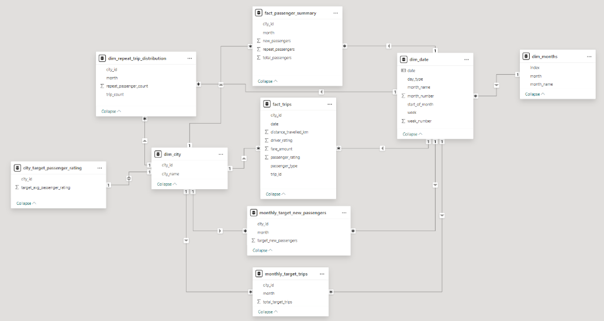

# Goodcabs_Sql_Powerbi_Analysis

## Business Problem
Assess the company's performance across key metrics to boost trip volume and improve passenger satisfaction.
- Trip Volume (Total Trips)
- Repeat Passenger Rate
- Passenger Satisfaction Scores
- Trip Distribution
- New v/s Repeat Passenger Trends

## Objectives
- Analyze dataset to address key Business Questions on City - Level Trip Performance, Passenger Trends, Revenue Patterns, and Target Achievement.
- Present findings in a clear and visually engaging manner to assist the Chief of Operations in making informed strategic decisions.

## Tools & Technologies
- SQL: Craft sql-queries to get table reports and answer business questions.
- Power BI: Create interactive, self-explanatory dashboard to get insights through visualizations.

## Data Cleaning & Transformation
- Used Power Query to clean and transform raw data.
- Removed duplicates and unnecessary columns.
- Applied the TRIM function to eliminate leading and trailing spaces.
- Added conditional columns where necessary.
- Created a dim_month table with unique months and their start dates.

## Data Model

## Dashboard Screenshots

### Main Page

### Executive Page
#### Revenue Analysis

#### Distance Analysis

#### Trips Analysis

### Passengers Page

### Rating Page

### Target Page

## Key Insights
- **Jaipur**: Contributes the highest to Trips (18%) and Revenue (₹37.2M, 34%) but relies heavily on New Passengers (80%).
- **Lucknow**: Ranks second in Trips (15%) but has low Revenue due to poor Ratings and lower Average Fare Per Trip.
- **Mysore**: Small contributor (4% of Trips) but exceeds Trip Targets by 20%, demonstrating high efficiency and satisfaction (Ratings above 8.0).
- **Surat**: Leads in Repeat Passenger Rate (42%) but struggles with Low Ratings due to lower fares.
- **Seasonal Trends**: Trips peaked in February and March, declining steadily afterwards, but Repeat Passenger loyalty increased during off-peak months.

## Recommendations
- Boost marketing efforts in low-performing cities and off-peak months with targeted campaigns and discounts.
-  Improve service quality in low-rated cities through driver training, vehicle upkeep, and personalized customer interactions.
-   Launch loyalty programs and referral bonuses in low RPR cities to encourage retention.
-   Reassess fare strategies to balance affordability and profitability, especially in tourism-focused cities to increase RPR.
-   Strengthen new passenger retention in tourism cities, enhance trip volume in business cities, and sustain balanced efforts across metrics in mixed-use cities.

  ## Reflections
- Improved skills in SQL, PowerBI.
- Gained hands-on experience in data analysis and storytelling.
- Developed a deeper understanding of ride-hailing operations, optimizing trip volume, pricing strategies.
- Applied technical knowledge to solve real-world data problems.

